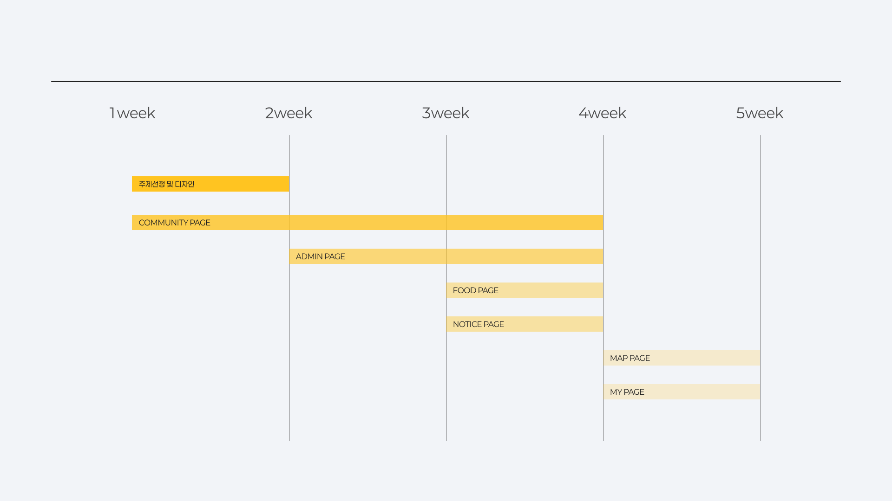
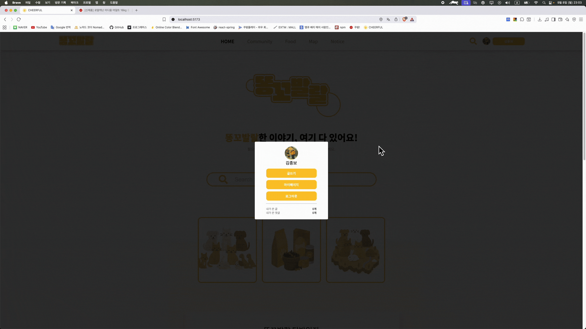
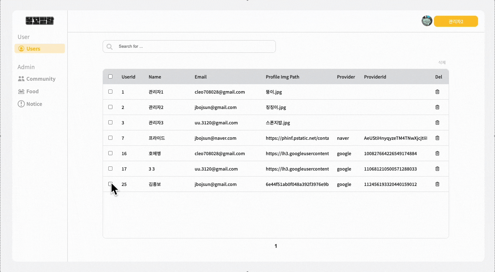
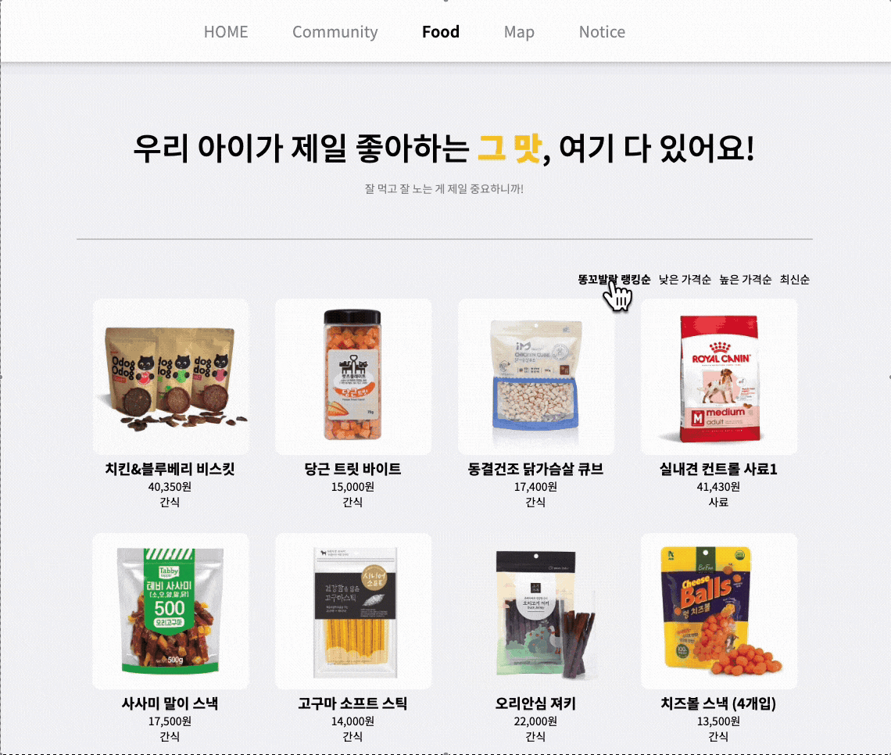
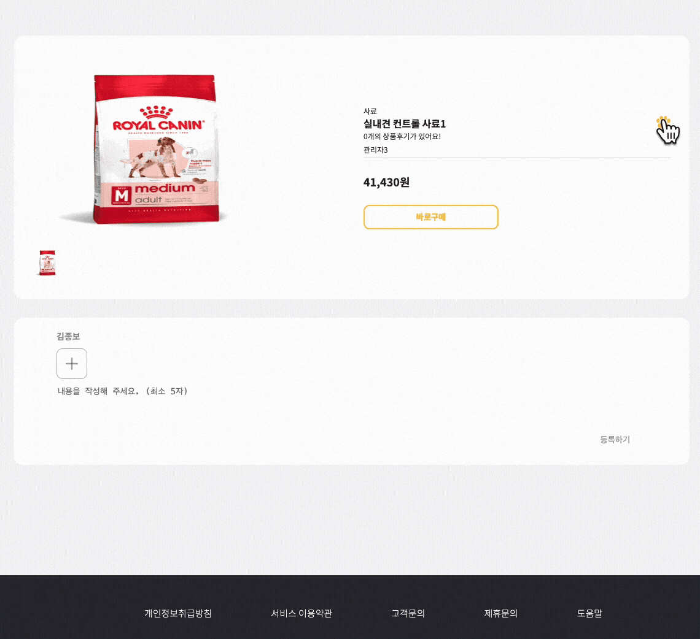

<div id="top"></div>

<div align='center'>

<h1><b>똥꼬발랄 CHEERFUL</b></h1>

🔗 [배포 링크](http://cheerfulpet.store)


</div>

<br>

## 0. 목차

1. [프로젝트 소개](#1)
2. [팀원 소개](#2)
3. [개발 일정](#3)
4. [기술 스택](#4)
5. [라이브러리 사용 이유](#5)
6. [브랜치 및 디렉토리 구조](#6)
7. [주요 기능 소개](#7)
8. [상세 담당 업무](#8)
9. [주요 코드 ](#9)
10. [트러블 슈팅](#10)

<br />

## <span id="1">🚩 1. 프로젝트 소개</span>

Notion: [CHEERFUL ](https://list-a.notion.site/241638f9b91b8024aa31d52fc9c1c53a)

- 내 위치 근처의 모든 응급병원, 반려동물 동반 카페, 유기동물 보호소를 보여주기 때문에 검색할 필요 없이 편리함
- ui 간소화 및 해당 아이콘 구별을 하여 직관적이게 표현

<br>

<!-- Top Button -->
<p style='background: black; width: 32px; height: 32px; border-radius: 50%; display: flex; justify-content: center; align-items: center; margin-left: auto;'><a href="#top" style='color: white; '>▲</a></p>

<br>

## <span id="2">🏃 2. 팀원 소개</span>

<div align="center">

|  |  |  |
| :-------------------------------------------------------: | :-------------------------------------------------------: | :-------------------------------------------------------: |
|          [노소정](https://github.com/sojeong132)          |          [김종보](https://github.com/JbleMaker)           |         [강미경](https://github.com/Mi-Kyung331)          |
|                  **Back-end 및 DB 관리**                  |                    **Front-end 개발**                     |              **Back-end 및 Web Site Design**              |

</div>

<br>

<!-- Top Button -->
<p style='background: black; width: 32px; height: 32px; border-radius: 50%; display: flex; justify-content: center; align-items: center; margin-left: auto;'><a href="#top" style='color: white; '>▲</a></p>

<br>

## <span id="3">📅 3. 개발 일정</span>

> 프로젝트 개발 기간: 2025.08.01 - 2025.09.12



<br>

<!-- Top Button -->
<p style='background: black; width: 32px; height: 32px; border-radius: 50%; display: flex; justify-content: center; align-items: center; margin-left: auto;'><a href="#top" style='color: white; '>▲</a></p>

<br>

## <span id="4">📚 4. 기술 스택</span>

<div align="center">
### 🛠 Environment


---

### ⚙️ Config & Package Manager


---

### 💻 Frontend


---

### 🖥 Backend & Database


---

### 📌 Project Management


---

### 🎨 Design


---

### 💬 Communication


</div>

<br>

<!-- Top Button -->
<p style='background: black; width: 32px; height: 32px; border-radius: 50%; display: flex; justify-content: center; align-items: center; margin-left: auto;'><a href="#top" style='color: white; '>▲</a></p>

<br>

## <span id="5">❓ 5. 라이브러리 사용 이유</span>

> Emotion

- 각 컴포넌트에 스타일이 캡슐화되어 전역스타일 충돌 방지 및 동적 props기반 스타일링 지원으로 상태에 따라 유연한 스타일 변경이 가능하여 사용.
  <br>

> react-google-maps/api

- 지도, 마커, 인포윈도우 등을 React컴포넌트처럼 관리가 가능하고 필요한 모듈만 불러오는 Tree Shaking지원으로 성능 최적화를 위해 사용.
  <br>

> React-query

- 캐싱, 자동 리패칭등 데이터 관리 기능 내장 및 useQuery, useMutation 혹을 간단히 API 데이터 호출이 가능하여 사용.
  <br>

> Axios

- 직관적인 API, 요청/응답 인터셉터 지원으로 토큰 기반 인증 처리에 유용하여 사용.
  <br>

> react-icons

- FontAwesome, Materialicons등 통합 ICON 제공등 편의성을 위해 사용
  <br>

> react-router

- 중첩 라우트, 동적 라우트등 강력한 기능 및 선언형 라우팅으로 URL에 따라 컴포넌트를 직관적으로 매핑하기 위해 사용.
  <br>

> zustand

- 가볍고 직관적인 전역 상태 관리를 위해 사용.
  <br>

<!-- Top Button -->
<p style='background: black; width: 32px; height: 32px; border-radius: 50%; display: flex; justify-content: center; align-items: center; margin-left: auto;'><a href="#top" style='color: white; '>▲</a></p>

<br>

## 6.<span id="6"> 🗂️ 디렉토리 구조</span>

<br>

> 디렉토리 구조

```
📂 cheerful_front
└── 📂 src
    ├── 📂 api                   # 서버 통신 (Axios 기반 API 모듈)
    │   ├── adminApi
    │   ├── authApi
    │   ├── axios
    │   ├── communityApi
    │   ├── foodApi
    │   ├── homeApi
    │   ├── mapApi
    │   ├── mypageApi
    │   ├── noticeApi
    │   └── searchApi
    │
    ├── 📂 components            # 공통 UI 컴포넌트
    │   ├── AdminManagementFoodModal
    │   ├── AdminManagementNoticeModal
    │   ├── AdminModal
    │   ├── CategoryComponent
    │   ├── DataTable
    │   ├── FoodImgSlider
    │   ├── Footer
    │   ├── Header
    │   ├── LeftSideBar
    │   ├── Loading
    │   ├── MyPageComponents
    │   ├── PageNation
    │   ├── Post
    │   ├── ScrollTop
    │   └── SearchBar
    │
    ├── 📂 constants             # 상수 및 전역 설정
    │   ├── adminPage
    │   ├── communityPage
    │   ├── foodPage
    │   ├── headerComponent
    │   ├── mapPage
    │   └── noticePage
    │
    ├── 📂 icons                 # 아이콘 모음
    ├── 📂 layout                # 메인 레이아웃
    │   └── MainLayout
    ├── 📂 logo                  # 로고 및 이미지 리소스
    │
    ├── 📂 pages                 # 주요 페이지
    │   ├── 📂 Admin
    │   │   ├── AdminLogin
    │   │   ├── AdminManager
    │   │   ├── CommunityManagement
    │   │   ├── FoodManagement
    │   │   ├── NoticeManagement
    │   │   └── UserManagement
    │   │
    │   ├── 📂 Auth
    │   │   ├── Auth
    │   │   ├── Login
    │   │   └── OAuthLogin
    │   │
    │   ├── 📂 Communities
    │   │   ├── Community
    │   │   ├── CommunityDetail
    │   │   └── CommunityRegister
    │   │
    │   ├── 📂 Food
    │   │   ├── Food
    │   │   └── FoodDetail
    │   │
    │   ├── Home
    │   ├── Map
    │   ├── MyPage
    │   ├── NotFound
    │   └── 📂 Notice
    │       ├── Notice
    │       ├── NoticeDetail
    │       └── Search
    │
    ├── 📂 queries               # React Query 커스텀 훅
    │   ├── AdminQuery
    │   ├── CommunityQuery
    │   ├── FoodQuery
    │   ├── HomeQuery
    │   ├── MapQuery
    │   ├── MyPageQuery
    │   ├── NoticeQuery
    │   ├── PrincipalQuery
    │   └── SearchQuery
    │
    ├── 📂 routers               # 라우터 설정
    ├── 📂 stores                # 전역 상태 관리 (Zustand 등)
    └── 📂 styles                # 전역 스타일 및 테마

📂 cheerful_back
└── 📂 src
    ├── 📂 main
    │   ├── 📂 java
    │   │   └── 📂 com.korit.cheerful_back
    │   │       ├── 📂 config            # 프로젝트 설정 관련 클래스
    │   │       ├── 📂 controller        # REST API 컨트롤러
    │   │       ├── 📂 domain            # 엔티티 및 도메인 객체
    │   │       ├── 📂 dto               # 데이터 전송 객체
    │   │       ├── 📂 exception.auth    # 인증/인가 예외 처리
    │   │       ├── 📂 security          # 보안 및 인증 설정
    │   │       ├── 📂 service           # 서비스 레이어 (비즈니스 로직)
    │   │       ├── 📂 util              # 유틸리티 클래스
    │   │       └── CheerfulBackApplication.java # 메인 실행 파일
    │   │
    │   └── 📂 resources
    │       ├── 📂 mapper                # MyBatis 매퍼 파일
    │       ├── 📄 application.yml       # 기본 환경 설정
    │       └── 📄 application-secret.yml # 보안 관련 설정 (gitignore 대상)

```

<br>

<!-- Top Button -->
<p style='background: black; width: 32px; height: 32px; border-radius: 50%; display: flex; justify-content: center; align-items: center; margin-left: auto;'><a href="#top" style='color: white; '>▲</a></p>

<br>

## <span id="7">7. 💻 주요 기능 소개</span>

### 1) 홈

#### 홈 화면


#### 마이페이지 화면



#### 관리자 페이지



---

### 2) 커뮤니티

#### 커뮤니티 메인 화면


#### 게시물 상세/댓글


---

### 3) 푸드

#### 푸드 메인 화면



#### 상품 상세/댓글



---

### 4) 지도(Map)

#### 지도 화면


---

### 5) 404 & 로딩 화면

#### 로딩 화면


<!-- Top Button -->
<p style='background: black; width: 32px; height: 32px; border-radius: 50%; display: flex; justify-content: center; align-items: center; margin-left: auto;'><a href="#top" style='color: white; '>▲</a></p>

<br>

## <span id="8">8. 📄 상세 담당 업무</span>

### 1) 노소정

- **🎨 백엔드**

  - 프로젝트 백엔드, DB담당

- **🧑‍💻 구현 기능**

  - OAuth 로그인, 관리자 로그인 기능
  - 홈화면 커뮤니티, 푸드 조회, 검색 기능
  - 커뮤니티 작성 및 댓글, 대댓글 작성 기능
  - 푸드 게시물 등록 및 리뷰 댓글 작성, 게시물 찜, 리뷰 댓글 좋아요 기능
  - 마이페이지 본인 게시물, 댓글, 찜한 푸드 목록 조회 기능
  - 관리자 페이지 유저, 커뮤니티, 푸드 조회 기능
  - 유저일 때 본인 게시물, 댓글 삭제 기능

### 2) 강미경

- **🎨 디자인 및 백엔드**

  - 프로젝트 디자인 및 백엔드 담당

- **🧑‍💻 구현 기능**

  - 관리자 로그인 기능
  - 커뮤니티 게시물 등록 및 댓글, 대댓글 작성, 게시글 좋아요 기능
  - 공지사항 게시물 등록 및 이벤트 댓글 작성, 게시글 좋아요 기능
  - 관리자 페이지 - 공지사항 게시글 수정 기능
  - 관리자페이지 단일삭제, 다중삭제 기능
  - 지도 API
  - 마이 페이지 프로필 수정, 회원탈퇴 기능
  - Admin 계정으로 로그인했을 시 게시글, 댓글 삭제 기능

### 3) 김종보

- **🎨 프론트엔드**

  - 프로젝트 프론트엔드 담당

- **💻 화면 개발**

  - 홈화면
  - 커뮤니티, 푸드, 지도, 공지사항 화면
  - 관리자페이지, 로딩, 404 화면
  - 프론트 Oauth2 및 로그인 화면

- **👩‍💻 구현 기능**

  - 라우터 기본 셋팅
  - 유저 로그인, 관리자 로그인 기능
  - 커뮤니티 게시글 작성 및 댓글, 대댓글 작성, 게시글 좋아요 및 댓글 좋아요 기능
  - 푸드 리뷰댓글 작성 및 좋아요, 찜 기능
  - 공지사항 참여댓글 및 게시글 좋아요 기능
  - 관리자 페이지 유저, 커뮤니티, 푸드, 공지사항 조회, 수정, 단일삭제, 다중삭제 기능

<br>

<!-- Top Button -->
<p style='background: black; width: 32px; height: 32px; border-radius: 50%; display: flex; justify-content: center; align-items: center; margin-left: auto;'><a href="#top" style='color: white; '>▲</a></p>

<br>

## <span id="9">✨ 9. 주요 코드</span>

<details>
<summary> 커뮤니티 게시글 등록 </summary>

<div>
커뮤니티 글 등록 (게시글 + 이미지 업로드)을 위한 코드. 사용자가 커뮤니티에 글을 작성할 때 제목과 내용을 저장하고, 필요하다면 이미지도 업로드해서 함께 저장하는 서비스 로직

```java
/*
  커뮤니티 글 등록 + 이미지 저장
*/
@Transactional(rollbackFor = Exception.class)
public void register(CommunityRegisterReqDto dto) {

    // 1) 사용자 식별
    Integer userId = principalUtil.getPrincipalUser().getUser().getUserId();

    // title 유효성 검사
    if (dto.getTitle() == null || dto.getTitle().trim().isEmpty()) {
        throw new IllegalArgumentException("제목이 없습니다.");
    }

    // content 유효성 검사
    if (dto.getContent() == null || dto.getContent().trim().isEmpty()) {
        throw new IllegalArgumentException("내용이 없습니다.");
    }

    // 2) 게시글 저장
    Community community = Community.builder()
            .userId(userId)
            .communityCategoryId(dto.getCommunityCategoryId())
            .title(dto.getTitle())
            .content(dto.getContent())
            .build();
    communityMapper.insert(community);

    // 3) 이미지 저장
      List<MultipartFile> imageFiles = dto.getFiles();

    if (imageFiles != null && !imageFiles.isEmpty()) {
        List<CommunityImg> communityImgs = new ArrayList<>();
        int seq = 1;

        for(MultipartFile file : imageFiles) {
            String imagePath = fileService.uploadFile(file, "community");

            CommunityImg communityImg = CommunityImg.builder()
                .communityId(community.getCommunityId())
                .seq(seq++)
                .imgPath(imagePath)
                .build();

            communityImgs.add(communityImg);
        }

        communityImgMapper.insertMany(communityImgs);
    }
}
```

</div>
</details>

<br>

<details>
<summary> 커뮤니티 게시글 내용보기 </summary>

<div>
특정 카테고리 내 특정 커뮤니티 게시글 상세 내용 조회 기능을 위한 코드

```java
/*
  특정 글 클릭해서 내용 보기
*/
public Community getCommunityContent(Integer categoryId, Integer communityId) {
    Integer userId = principalUtil.getPrincipalUser().getUser().getUserId();

    // 게시글 단건 조회
    Community community = communityMapper.findByOption(categoryId, communityId, userId);
    if(community == null) {
        throw new NotFoundException("Community not found with id = " + communityId);
    }

    // 이미지 URL 세팅
    List<CommunityImg> imgs = community.getCommunityImgs();
    if(imgs != null && !imgs.isEmpty()) {
        imgs.sort(Comparator.comparingInt(CommunityImg::getSeq));
        imgs.forEach(img -> img.setImgUrl(imageUrlUtil.community(img.getImgPath())));
    }

    // 댓글도 조회해서 세팅
    List<CommunityComment> comments = communityCommentMapper.findAllByCommunityId(categoryId, communityId);

    comments.forEach(c -> {
        var u = c.getUser();
        if(u != null) {
            u.setProfileImgUrl(imageUrlUtil.profile(u.getProfileImgPath()));
        }
    });
    community.setCommunityComments(comments);

    return community;
}

```

</div>
</details>

<br>

<details>
<summary> 지도(현재 위치 값 전달) </summary>

<div>
임의 입력값을 숫자좌표로 안전하게 변한 {lat, lng} 혹은 null로 반환
카테고리가 변경될 시 categoryId를 문자열이 아닌 숫자로 변환 후 전달

```jsx
const { category } = useParams();
const mapRef = useRef(null);
const centerRef = useRef({ lat: 35.1595454, lng: 129.0616078 });

const [searchMap, setSearchMap] = useState({
  lat: centerRef.current.lat,
  lng: centerRef.current.lng,
  radius: 3000,
  categoryId: Number(category),
});

const [selected, setSelected] = useState(null);

const toLatLng = (lat, lng) => {
  const _lat = Number(lat);
  const _lng = Number(lng);
  return Number.isFinite(_lat) && Number.isFinite(_lng)
    ? { lat: _lat, lng: _lng }
    : null;
};

const [center, setCenter] = useState(null);

useEffect(() => {
  setSearchMap((prev) => ({
    ...prev,
    categoryId: Number(category),
  }));
}, [category]);
```

</div>
</details>

<br>

<details>
<summary> 관리자 - 게시글 수정(먹거리) </summary>

<div>
게시글(먹거리, 공지사항) 등 관리자가 작성한 게시글을 수정할 수 있는 기능을 위한 코드

```java
/*
  food 글 수정
*/
public void modifyFood(FoodModifyReqDto dto) {

    // title 유효성 검사
    if (dto.getTitle() == null || dto.getTitle().trim().isEmpty()) {
        throw new IllegalArgumentException("제목이 없습니다.");
    }

    // content 유효성 검사
    if (dto.getContent() == null || dto.getContent().trim().isEmpty()) {
        throw new IllegalArgumentException("내용이 없습니다.");
    }

    // price 유효성 검사
    if (dto.getPrice() == null) {
        throw new IllegalArgumentException("가격이 없습니다.");
    }

    // address 유효성 검사
    if (dto.getFoodAddress() == null || dto.getFoodAddress().trim().isEmpty()) {
        throw new IllegalArgumentException("주소가 없습니다.");
    }

    // file 유효성 검사
    if (dto.getFiles().stream().anyMatch(MultipartFile::isEmpty)) {
        throw new IllegalArgumentException("사진이 없습니다.");
    }

    // 글 수정
    Food food = dto.toEntity();
    foodMapper.update(food);

    // 이미지 삭제
    foodMapper.deleteFoodImages(food.getFoodId());
    // 이미지 등록
    List<MultipartFile> imageFiles = dto.getFiles();

    if (imageFiles != null && !imageFiles.isEmpty()) {
        List<FoodImg> foodImgs = new ArrayList<>();
        int seq = 1;

        for (MultipartFile file : imageFiles) {
            String imagePath = fileService.uploadFile(file, "food");

            FoodImg foodImg = FoodImg.builder()
                    .foodId(food.getFoodId())
                    .seq(seq++)
                    .imgPath(imagePath)
                    .build();

            foodImgs.add(foodImg);
        }

        foodMapper.insertFoodImages(foodImgs);
    }
}

```

</div>
</details>

<br>

<!-- Top Button -->
<p style='background: black; width: 32px; height: 32px; border-radius: 50%; display: flex; justify-content: center; align-items: center; margin-left: auto;'><a href="#top" style='color: white; '>▲</a></p>

<br>

## <span id="10">🚦 10. 트러블 슈팅</span>

<details>
<summary> 관리자 페이지 가독성 및 복잡성 문제 </summary>

<div>

1. 문제 상황
   기존 코드는 props에 따라 각 기능을 if문을 사용하여 분기를 나누어 동작하도록 하였음.
   해당 방식은 너무 많은 양의 props를 전달하도록 만들었고, 가독성이 나빠짐과 더불어 코드의 유지보수도 힘들어졌음.
   또한 페이지네이션을 사용하기 위해서 props를 내려주었는데 해당 방식의 경우 props를 각 페이지에 따라 기능 하는것이
   아닌 전역상태로 관리해야되다 보니 페이지네이션 기능이 원활히 작동 하지 않게 되었음.

```javascript
function DataTable({
  isCheckBoxEnabled,
  cols,
  rows,
  pagenation,
  categoryName,
  categoryId,
  setCategoryId,
  refetch,
  enabledRegisterButton,
  enabledDeleteButton,
  enabledCategoryList,
  categoryList,
  onRegister,
  onDelete,
})
```

```javascript
{
  categoryName === "food" || categoryName === "notice" ? (
    <td
      css={s.modifyButton}
      onClick={() => handleModifyOnClick(row.datas[0].value)}>
      <LiaEditSolid />
    </td>
  ) : (
    <td
      css={s.deleteButton}
      onClick={() => handleDeleteOnClick(row.datas[0].value)}>
      <FaRegTrashAlt />
    </td>
  );
}
```

<br />

2. 해결방안
   카테고리를 사용해 분기점을 나누던 페이지와 내부 기능들을 각 페이지와 기능에 맞게
   컴포넌트를 나누어 Routes를 사용해 분산하여 과하게 전달되던 props를 줄이고, 코드의 가독성과 복잡성을 줄임

```jsx
<Routes>
  <Route path="/users" element={<UserMangement />} />
  <Route path="/community" element={<CommunityManagement />} />
  <Route path="/food" element={<FoodManagement />} />
  <Route path="/notice" element={<NoticeManagement />} />
</Routes>
```

<br />

</div>
</details>

<br>

<details>
<summary> 이미지 URL 반환</summary>

<div>

1. 문제 상황
   기존 코드는 imgPath에 단순 경로를 저장하기 때문에 이미지 업로드와 DB 저장이 분리되지 않았고, URL 가공/변환 과정이 없어 프론트로 이미지 경로를 보냈을 때 가공이 필요했음. 하지만 해당 코드로 유지보수를 하게 되자 백앤드에서 프론트로 이미지 경로를 보내줄 때 프론트에서 별다른 가공할 필요가 없이 이미지 파일을 바로 사용할 수 있게 됨.

```java
AtomicInteger atomicInteger = new AtomicInteger(0);
      List<CommunityImg> communityImgs = uploadFilepath.stream()
              .map(path -> CommunityImg.builder()
                      .seq(atomicInteger.getAndIncrement() + 1)
                      .communityId(community.getCommunityId())
                      .imgPath(path)
                      .build())
              .collect(Collectors.toList());
      communityImgMapper.insertMany(communityImgs);

      if (!uploadFilepath.isEmpty()) {
          AtomicInteger atomicInteger = new AtomicInteger(0);
          List<CommunityImg> communityImgs = uploadFilepath.stream()
                  .map(path -> CommunityImg.builder()
                          .seq(atomicInteger.getAndIncrement() + 1)
                          .communityId(community.getCommunityId())
                          .imgPath(path)
                          .build())
                  .collect(Collectors.toList());
          communityImgMapper.insertMany(communityImgs);
      }

      System.out.println(uploadFilepath);
```

<br />

2. 해결방안

```java
List<MultipartFile> imageFiles = dto.getFiles();

        if (imageFiles != null && !imageFiles.isEmpty()) {
            List<CommunityImg> communityImgs = new ArrayList<>();
            int seq = 1;

            for(MultipartFile file : imageFiles) {
                String imagePath = fileService.uploadFile(file, "community");

                CommunityImg communityImg = CommunityImg.builder()
                    .communityId(community.getCommunityId())
                    .seq(seq++)
                    .imgPath(imagePath)
                    .build();

                communityImgs.add(communityImg);
            }

            communityImgMapper.insertMany(communityImgs);
        }

```

```java
public String profile(String path) {
    return buildImageUrl(path, "profile");
  }
  public String community(String path) {
    return buildImageUrl(path, "community");
  }
  public String food(String path) {
    return buildImageUrl(path, "food");
  }
  public String foodComment(String path) {
    return buildImageUrl(path, "foodComment", false);
  }
  public String notice(String path) {
    return buildImageUrl(path, "notice", false);
  }
  public String noticeComment(String path) {
    return buildImageUrl(path, "noticeComment", false);
  }
```

   <br />

</div>
</details>

<br>

<!-- Top Button -->
<p style='background: black; width: 32px; height: 32px; border-radius: 50%; display: flex; justify-content: center; align-items: center; margin-left: auto;'><a href="#top" style='color: white; '>▲</a></p>
